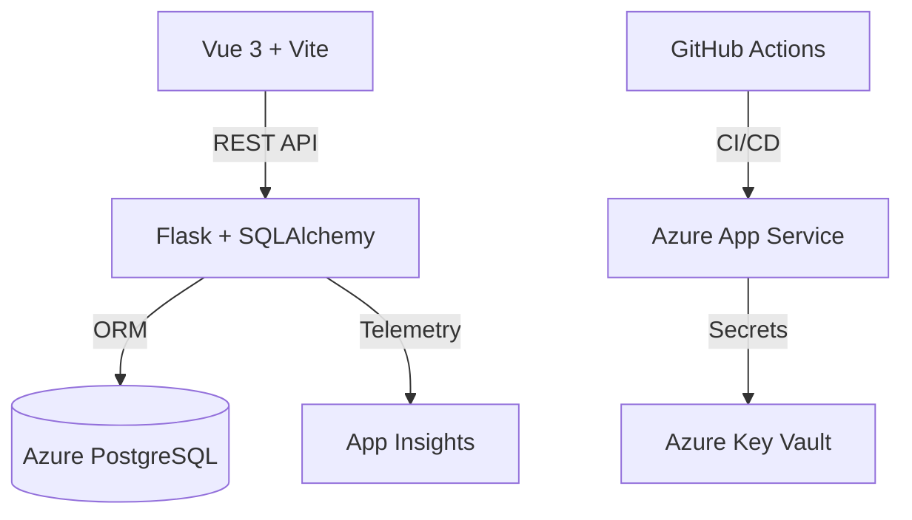

# Software Requirements Specification (SRS) – [Project Name]

## 1. Project Overview
Brief summary of the app, tech stack, and business goal.

## 2. Functional Requirements
- Home page with navigation
- Add "country" field to user model/form
- Unit and functional tests for new features
- Dev + UAT environments (specs: B1, B1ms)
- CI/CD: Dev (any branch), UAT (PR→main & main; manual trigger)
- GitHub Flow branch protection
- Add *julioas09* as collaborator

## 3. Non-Functional Requirements
- Python 3.11, Flask, SQLAlchemy, Vue 3, Vite
- Azure App Service (Linux), Azure PostgreSQL Flexible
- Monitoring: Azure Application Insights
- Security: GitHub branch protection, Key Vault for secrets

## 4. Architecture Overview

## 5. Acceptance Criteria
- [ ] Home page and country field implemented
- [ ] Tests passing in CI
- [ ] Branch protection enabled
- [ ] Dev/UAT deploys succeed
- [ ] *julioas09* has access

---

*Edit as needed for your project specifics.* 